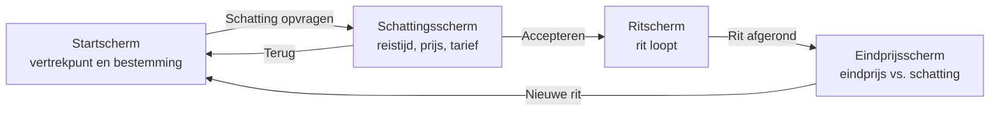
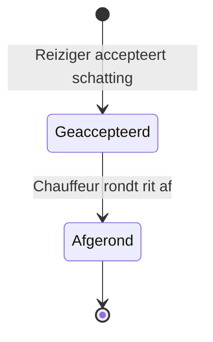
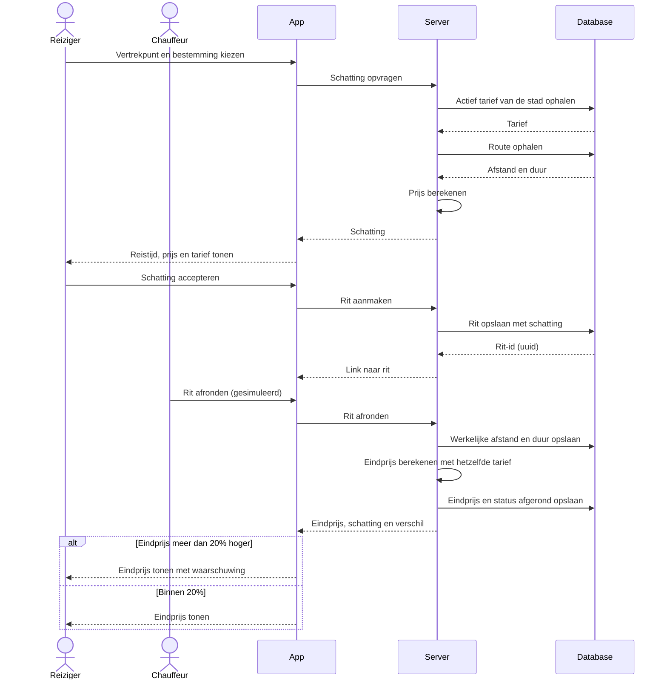

# Aanvullende diagrammen HitchTracker

Mermaid-diagrammen (schermnavigatie, status, sequence). GitHub rendert ze direct.
De beoordeelde ontwerplagen staan in erd.dbml, use-case.puml en activiteitendiagram.puml.

## Schermnavigatie

## Status van een rit

## Sequencediagram kernflow

