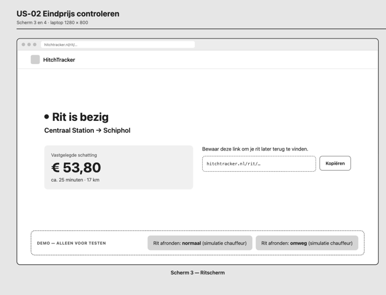
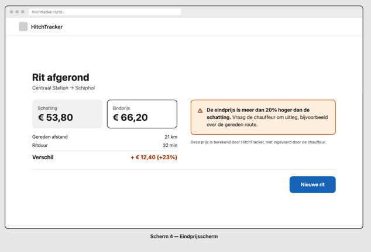
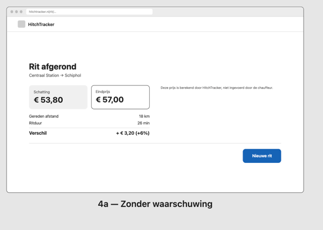

# Eis aan een ontwerp

29.09.2026 | V.1.0.0

Hackathon 2 | HitchTracker

Ahmad Alasmi

# Probleemomschrijving

Toeristen die in een onbekende stad een taxi nemen, weten vaak niet wat een reële prijs is en welke route logisch is. Daardoor betalen ze soms veel te veel, bijvoorbeeld € 45 voor een kort stukje. Een investeerder wil een oplossing die de veiligheid van toeristen vergroot: de reiziger moet kunnen zien welke route de chauffeur rijdt, hoe ver de rit is en wat die kost.

In deze hackathon richten we ons op de kern van dat probleem: vóór de rit een eerlijke schatting geven, en na de rit laten zien of de eindprijs daarbij past.

# Requirements (PvE, programma van Eisen: wat wil de klant?)

**Functionele eisen**

- De reiziger kiest een vertrekpunt en een bestemming uit vaste ophaalpunten.
- Het systeem geeft een schatting van de reistijd en de prijs, op basis van het tarief van de stad.
- Het systeem laat zien welk tarief voor de schatting is gebruikt.
- Pas als de reiziger de schatting accepteert, wordt de rit opgeslagen.
- Als een stad geen actief tarief heeft, geeft het systeem geen schatting maar een melding.
- Na de rit ziet de reiziger de eindprijs, de gereden afstand en de ritduur.
- Het systeem berekent de eindprijs met hetzelfde tarief als de schatting. De chauffeur kan geen prijs invoeren.
- Het systeem toont het verschil tussen eindprijs en schatting in euro's en procenten.
- Is de eindprijs meer dan 20% hoger dan de schatting, dan krijgt de reiziger een waarschuwing.

**Niet-functionele eisen**

- Er zijn geen accounts: het systeem slaat geen namen, e-mailadressen of andere persoonsgegevens op.
- Het systeem gebruikt vaste ophaalpunten, geen GPS-locatie van de reiziger.
- Ritgegevens worden na 30 dagen verwijderd.
- Een rit is alleen op te vragen via een link met een niet te raden id.
- Invoer wordt op de server gecontroleerd, niet alleen in de browser.
- Bedragen worden in centen opgeslagen, zodat er geen afrondingsfouten ontstaan.
- De webapplicatie werkt in een desktopbrowser (ontworpen op 1280 × 800).

# Beschrijving van de oplossing voor de klant

_(Hoe ziet het eruit voor de klant, hoe werkt het voor de klant)_

## Gebruikersperspectief

De reiziger opent HitchTracker in de browser, kiest waar hij vandaan komt en waar hij heen wil, en ziet direct wat de rit ongeveer kost en hoe lang die duurt. Accepteert hij de schatting, dan krijgt hij een link naar zijn rit. Na de rit ziet hij op die pagina de eindprijs naast de schatting. Is de rit veel duurder geworden, dan waarschuwt de app hem.

### Wireframes

Bron: [wireframe-schatting.png](img/wireframe-schatting.png) · [wireframe-ritscherm.png](img/wireframe-ritscherm.png) · [wireframe-eindprijsscherm.png](img/wireframe-eindprijsscherm.png) · [wireframe-eindprijsscherm-zonder-waarschuwing.png](img/wireframe-eindprijsscherm-zonder-waarschuwing.png)

### Schermnavigatie

Zie [diagrammen.md](diagrammen/diagrammen.md#schermnavigatie) voor de navigatie tussen de schermen.

### Use case diagram

Bron: [use-case.puml](diagrammen/use-case.puml)

**`<<include>>`**: verplicht, gebeurt altijd

**`<<extend>>`**: optioneel, alleen onder een voorwaarde

## User stories

_Use cases met definition of done, voorzien van prioritering en tijdsindicatie._

## US-01 | Ritschatting vooraf | Prioriteit: Must have | Tijdsindicatie: 2 dagen

Als reiziger wil ik in de webapp een vertrekpunt en bestemming invoeren, zodat ik vóór de rit weet hoe lang die ongeveer duurt en wat die ongeveer kost.

**Acceptatiecriteria**

- AC-01.1 Vertrekpunt en bestemming zijn allebei verplicht. Ontbreekt er één, dan krijgt de reiziger een melding en wordt er geen schatting gemaakt.
- AC-01.2 De schatting toont de verwachte reistijd in minuten en de verwachte prijs in euro's.
- AC-01.3 De prijs wordt berekend met het tarief van de stad: starttarief + prijs per km + prijs per minuut. De reiziger ziet welk tarief is gebruikt.
- AC-01.4 Accepteert de reiziger de schatting, dan wordt er een rit aangemaakt en wordt de schatting bij die rit vastgelegd. Zonder acceptatie wordt er niets opgeslagen.
- AC-01.5 Ligt de bestemming buiten een stad met een bekend tarief, dan krijgt de reiziger een melding dat er geen schatting mogelijk is.

Het tarief is dat van de stad van het vertrekpunt. Is er geen route of geen actief tarief, dan geldt de melding van AC-01.5.

**Prioritering:** US-01 eerst. US-02 vergelijkt de eindprijs met de schatting die in US-01 wordt vastgelegd (AC-01.4); zonder US-01 heeft US-02 niets om mee te vergelijken.

## US-02 | Eindprijs controleren | Prioriteit: Must have | Tijdsindicatie: 1,5 dag

Als reiziger wil ik na de rit de eindprijs naast de schatting zien, zodat ik weet of de chauffeur mij niet te veel laat betalen.

**Acceptatiecriteria**

- AC-02.1 Na het afronden van de rit ziet de reiziger de eindprijs, de gereden afstand en de ritduur.
- AC-02.2 De eindprijs wordt berekend door het systeem, met hetzelfde tarief als de schatting en de werkelijke afstand en duur. De chauffeur kan geen prijs invoeren.
- AC-02.3 De eindprijs staat naast de vastgelegde schatting, met het verschil in euro's en procenten.
- AC-02.4 Is de eindprijs meer dan 20% hoger dan de schatting, dan ziet de reiziger een duidelijke waarschuwing met het advies de chauffeur aan te spreken.

## Definition of Done

- Code gepusht en via een pull request gemerged naar h2-hitchtracker in GitHub
- Getest volgens het testplan: hoofdscenario + minimaal één alternatief scenario, alle acceptatiecriteria geslaagd
- Integratie- en acceptatietest voor deze story uitgevoerd en vastgelegd in het testrapport
- Code voldoet aan de afgesproken code conventions
- Door een ander gereviewd (begeleider of medestudent)

## Hardware

De reiziger gebruikt HitchTracker als webapplicatie in de browser. De schermen zijn ontworpen op desktopformaat (1280 × 800). Er is geen aparte hardware nodig.

# Beschrijving van de oplossing voor opdrachtgever

## Datamodel

Bron: [erd.dbml](diagrammen/erd.dbml)

Het datamodel bestaat uit vijf tabellen. `cities` en `tariffs` leggen per stad vast wat een rit kost. `locations` bevat de vaste ophaalpunten per stad. `routes` bevat per combinatie van twee ophaalpunten de afstand en duur; dit is een koppeltabel tussen `locations` en zichzelf, die in de MVP een externe routeservice vervangt. `rides` bevat per rit de vastgelegde schatting en, na afloop, de werkelijke afstand, duur en eindprijs.

## Programmalogica

Bron: [activiteitendiagram.puml](diagrammen/activiteitendiagram.puml)

Het activiteitendiagram laat de kernflow zien in drie swimlanes: Reiziger, Systeem en Chauffeur (gesimuleerd). De reiziger vraagt een schatting op; het systeem controleert de invoer en het tarief en rekent de prijs uit. Na acceptatie wordt de rit vastgelegd. Als de chauffeur de rit afrondt, berekent het systeem de eindprijs met hetzelfde tarief, vergelijkt die met de schatting en toont bij meer dan 20% verschil een waarschuwing.

## Hardware

In deze fase geen aparte hardware: alles draait als webapplicatie. Later uitbreidbaar met een scherm achter in de taxi, zoals de klant noemt, en met een koppeling aan de taximeter.

## Infrastructuur

De webapplicatie en een PostgreSQL-database draaien op een cloudserver. De reiziger verbindt via zijn eigen internetverbinding. Afstanden en reistijden komen in de MVP uit een eigen tabel met testdata. In het echte product worden die opgehaald bij een externe routeservice.

# Onderbouwing / verantwoording

_Waarom gekozen voor X en niet voor Y (ethiek/privacy/security)_

**Security: prijs berekend door het systeem.** De chauffeur kan geen bedrag invoeren. Het systeem rekent de eindprijs uit met het vastgelegde tarief en de werkelijke afstand en duur. Dat is de kern van de klantwens: de reiziger hoeft de chauffeur niet op zijn woord te geloven.

**Security: tarieven worden nooit gewijzigd, alleen vervangen.** Een rit verwijst naar het tarief waarmee de schatting is gemaakt. Zou je een tarief aanpassen, dan veranderen ook oude ritten achteraf. Daarom krijgt een nieuw tarief een nieuwe rij en wordt de oude op inactief gezet. Zo wordt de eindprijs gegarandeerd met hetzelfde tarief berekend als de schatting.

**Security: niet te raden rit-link.** De reiziger opent zijn rit via een link. Met oplopende nummers (/rit/5, /rit/6) zou iemand andermans rit kunnen bekijken. Daarom heeft elke rit een uuid als id.

**Privacy: dataminimalisatie.** HitchTracker werkt zonder accounts en slaat geen persoonsgegevens op. De reiziger kiest uit vaste ophaalpunten, zodat er geen GPS-locatie wordt vastgelegd. Toch kunnen ritten iets zeggen over iemand (bijvoorbeeld "hotel naar ziekenhuis"). Daarom worden ritgegevens na 30 dagen verwijderd: lang genoeg om een klacht over een rit af te handelen, niet langer dan nodig. Het verwijderen van ritten ouder dan 30 dagen gebeurt handmatig via een script (npm run ritten:opschonen). In productie wordt dit een geplande taak.

**Ethiek: eerlijke waarschuwing.** De waarschuwing beschuldigt de chauffeur niet. Een omleiding of file kan een hogere prijs verklaren. Daarom ligt de grens op 20% en adviseert de app de reiziger om uitleg te vragen, in plaats van te zeggen dat hij is opgelicht. Ook ziet de reiziger altijd welk tarief is gebruikt, zodat hij de berekening kan volgen (transparantie).

**Haalbaarheid: afbakening.** Deze hackathon bouwt Epic 1 (schatting vooraf) en Epic 3 (eindprijs achteraf). Epic 2 (live route en prijs tijdens de rit) vraagt om GPS en kaarten en is niet haalbaar in één realisatieweek. Accounts, betalen en een chauffeursapp vallen ook buiten scope. Het afronden van een rit wordt gesimuleerd met een demoknop. De demoknop simuleert een rit met een vaste afwijking op de schatting: 'normaal' (afstand +5%, duur +5%) of 'omweg' (afstand +25%, duur +30%), zodat beide uitkomsten testbaar zijn.

**Haalbaarheid: desktop.** Gekozen voor desktop omdat de MVP op een laptop wordt gebouwd, getest en gedemonstreerd. Een mobiele weergave is een logische vervolgstap, maar valt buiten deze hackathon.

## Budget

Er is geen hardware nodig. De kosten blijven beperkt tot hosting van de webapplicatie en database. In een latere fase komen daar de kosten van een externe routeservice bij.

## Planning/Fasering

Week 1: ontwerpen (W2), dit document.

Week 2: realiseren (W3), eerst US-01, dan US-02.

Week 3: testen (W4), integratie- en acceptatietest, testrapport.
