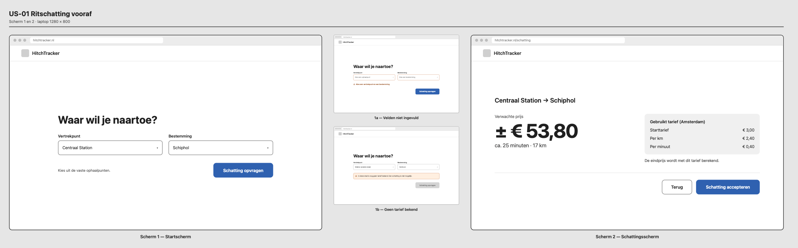
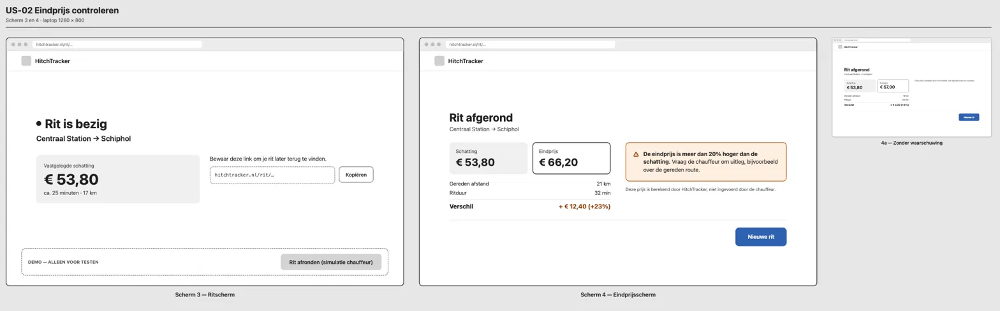
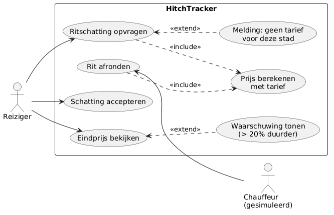
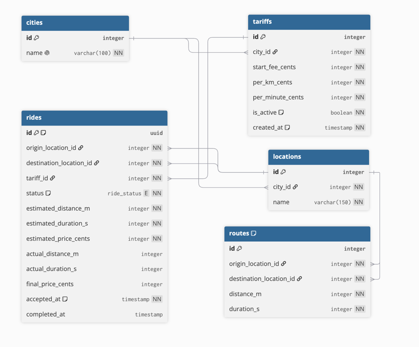
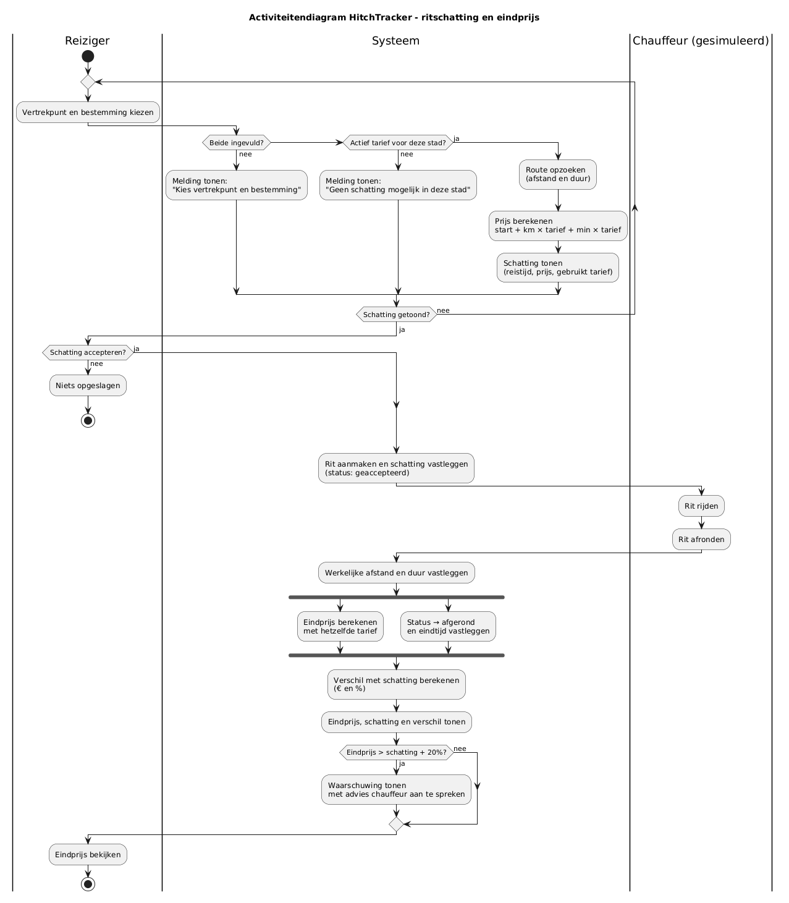

# Eis aan een ontwerp

29.09.2026 | V.1.0.0
Hackathon 2 | HitchTracker
Ahmad Alasmi

# Probleemomschrijving

_TODO_

# Requirements (PvE, programma van Eisen – Wat wil de klant?)

**Functionele eisen**

- _TODO_

**Niet-functionele eisen**

- _TODO_

# Beschrijving van de oplossing voor de klant

_(Hoe ziet het eruit voor de klant, hoe werkt het voor de klant)_

## Gebruikersperspectief

### Wireframes

Link: _TODO_

### Schermnavigatie

Zie [diagrammen.md](diagrammen/diagrammen.md#schermnavigatie) voor de navigatie tussen de schermen.

### Use case diagram

Bron: [use-case.puml](diagrammen/use-case.puml)

**<<include>>** – verplicht, gebeurt altijd
**<<extend>>** – optioneel, alleen onder een voorwaarde

## User stories

_Use cases met definition of done, voorzien van prioritering en tijdsindicatie._

## US-01 | Ritschatting vooraf | Prioriteit: Must have | Tijdsindicatie: _TODO_

_TODO_

**Acceptatiecriteria**

- _TODO_

## US-02 | Eindprijs controleren | Prioriteit: Must have | Tijdsindicatie: _TODO_

_TODO_

**Acceptatiecriteria**

- _TODO_

## Definition of Done

- _TODO_

## Hardware

_TODO_

# Beschrijving van de oplossing voor opdrachtgever

## Datamodel

Bron: [erd.dbml](diagrammen/erd.dbml)

## Programmalogica

Bron: [activiteitendiagram.puml](diagrammen/activiteitendiagram.puml)

## Hardware

_TODO_

## Infrastructuur

_TODO_

# Onderbouwing / verantwoording

_Waarom gekozen voor X en niet voor Y (ethiek/privacy/security)_

- _TODO_

## Budget

_TODO_

## Planning/Fasering

_TODO_
